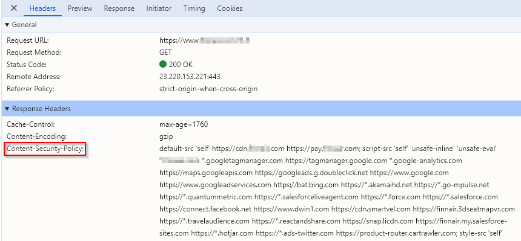

# Server-Side Vulnerabilites

Server-side vulnerabilities refer to weaknesses in the backend of a web application, where critical processing and data handling occur. These flaws can be exploited by attackers to gain unauthorized access, manipulate data, or compromise the entire system. Common examples include **SQL Injection**, **Remote Code Execution (RCE)**, and **Insecure File Uploads**. Addressing these vulnerabilities is crucial, as they often expose sensitive information and can lead to severe security breaches.

In this section, we’ll explore various server-side vulnerabilities, their potential impact, and best practices for mitigating them.

<figure><figcaption>
Server-Side Vulnerabilites
</figcaption></figure>
